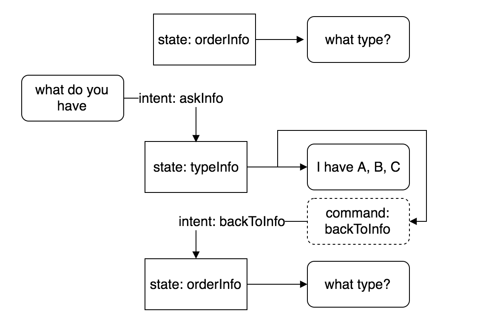

Action is the part which triggers responses to the user. Action can be attached to a certain state, so that it will be triggered when the flow reaches certain state.

## Types

There are many types of actions:

- `text` - returns one or multiple text bubble
- `image` - returns image
- `template` - returns rich action
- `command` - trigger command
- `api` - trigger an API call.

Example:

```yaml
actions:
  type: text
  options:
    text: hello $(data.name)!
```

For more in on how to use specific types of actions please refer to KataML Spec.

## Dollar Notation

Variables can be accessed in action options using `$()` notation. Following variables are available:

- `content` message content
- `payload` message payload
- `type` message type
- `metadata` message metadata
- `intent` message intent
- `attributes` message attributes
- `context` flow context
- `data` session data
- `result` result from API call (see Result subchapter)

## Condition

Multiple actions can be defined in a state. Not all actions need to be executed. The execution of the state can be controlled using condition:

```yaml
states:
  orderInfo:
    action:
      - name: recordOrder
        condition: "intent == 'addDetails' &&
          (attributes.pizzaType || attributes.pizzaSize || attributes.pizzaCrust || attributes.pizzaQuantity)"
      - name: askPizzaType
        condition: '!context.type'
      - name: askPizzaCrust
        condition: 'context.type &&!context.crust'
      - name: askPizzaSize
        condition: 'context.type &&context.crust &&!context.size'
      - name: askPizzaQuantity
        condition: 'context.type &&context.crust &&context.size &&!context.quantity'
```

## Command

You can specify a command action that will trigger re-converse. A command action will not be returned to the user but will be used as the next input of the conversation.



Example:

```yaml
actions:
    nextAction:
        type: command
        command: next
  intents:
    next:
        type: command
        condition: content == "next"
```

Note: Command can also be used to trigger other flow.

## Result

Multiple actions are executed sequentially. Some action type return result that can be used in the next action. An example for this is the api action that trigger an http call.

```yaml
actions:
  getGithubProfile:
    type: api
    options:
      uri: https://api.github.com/users/$(context.user)
myState:
  action:
    - name: getGithubProfile
    - name: text
      options:
        text: email of $(context.user) is $(result.email)
```
